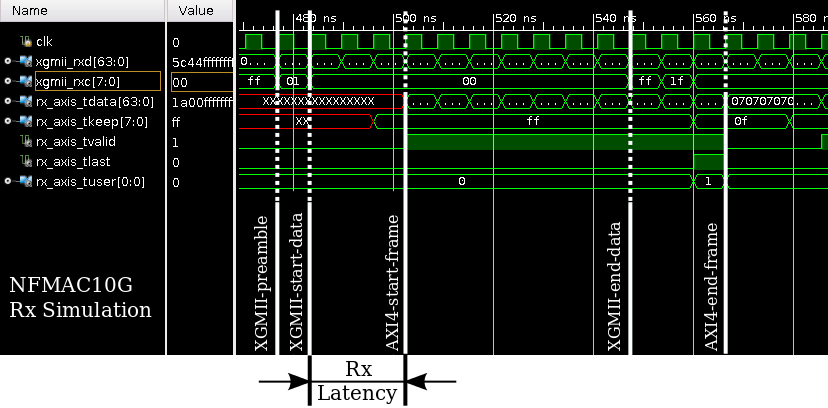
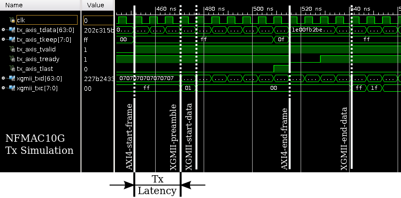

NFMAC10G: Open Source 10GbE MAC for FPGAs
-----------------------------------------

Author: [Marco Forconesi](https://www.linkedin.com/in/forconesi)

Acknowledges:  
Prof. Gustavo Sutter and Prof. Sergio Lopez-Buedo  
University of Cambridge NetFPGA team

Description
-----------

NetFPGA-MAC-10G (nfmac10g) is a hardware IP core that implements an Ethernet Media Access Control for 10Gbps links, according to the IEEE 802.3-2012 specification.

License
-------

The nfmac10g core has the standard NetFPGA license. See [NetFPGA C.I.C](http://netfpga-cic.org/) for more details.

Compatibility
-------------

The core was designed to be ported as a functional equivalent to Xilinx 10GbE MAC (ten_gig_eth_mac). The motivation behind the development is to have an open-source version of the aforementioned core.

On the user side a pair of AXI4-Stream (one master and one slave) interfaces are used to send and receive Ethernet frames from/to the user logic. On the opposite side a pair of XGMII interfaces are used to transfer frames between the nfmac10g and the PCS/PMA (or XAUI) core.

Simulation and verification
---------------------------

A Makefile controls the simulation of the core. The test suite covers:  
* Line-rate capable for both Rx and Tx  
* Detection of bad FCS (CRC) frames  
* Detection of invalid inbound frame size  
* Padding to the minimum frame size in Tx  
* Explicit and implicit Tx underrun  
* Capable of operating with Xilinx ten_gig_eth_mac core, i.e. nfmac10g receives frames produced by Xilinx core and Xilinx core receives frames produced by nfmac10g  

`$ make sim PCAP=your_pcap_file.pcap # runs the test suite in batch mode and leaves an output log file`

Performance evaluation: Latency and Throughput
-----------------------------------

NFMAC10G achieves 10Gbps line-rate in both Tx and Rx directions. The core is buffer-less which means no FIFO or buffer exists in the Rx nor Tx datapath.

Rx:
* Latency is 3 clock cycles or 19.2ns @156.25MHz (from the first byte of data to ingress the XGMII until the last byte appears in the AXI4-Stream, minus frame length).  
* Inboud frames of any length can be received from the wire with the minimum Inter Frame Gap (IFG) required by the standard (5B).  

Tx:
* Latency is 3 clock cycles or 19.2ns @156.25MHz (from the first byte to ingress the AXI4-Stream until the last byte appears in the XGMII, minus frame length, minus preamble).  
* Deficit Idle Count (DCI) is implemented to achieve full bandwidth. This means that the IFG is squeezed from time to time to allow less than the minimum (12B), as long as the average is maintained at 12B.  

Implementation on Virtex-7 FPGA
-------------------------------

The reported WNS is 3.354ns when synthesised with Vivado 2015.4 on the FPGA xc7vx690t-3 (which is present on the NetFPGA-SUME). The reported resources are shown in the table below.

|Resource|Used|Util%|
|----|:---:|:--:|
|LUTs| 2584|0.60|
|FFs| 1204|0.14|

`$ make synth # runs synthesis and reports timing and resource usage`

Limitations
-----------

Although the nfmac10g is compatible with the Xilinx ten_gig_eth_mac, only the needed functionality in the NetFPGA project was implemented. In other words, some of the advanced configurations of the Xilinx core are not present in the nfmac10g. Users are encouraged to submit pull requests with extensions and improvements.

Suggestions for the implementation of the additional features:
* 32bit width interface (only 64bit is implemented)  
* IEEE-1588 timestamping  
* MDIO interface  
* Priority-based flow control  
* Pause frame request  
* Specify Tx side minimum IFG  
* Local or remote fault flag (status_vector)  
* Statistics Vector Signals  

User interface (xge_intf) module
--------------------------------

An additional core (provided under usr_intf) can be optionally plugged in between the user logic and the nfmac10g -- it makes user logic design simpler, at expense of increased latency, because: (i) it supports the user to apply back pressure on the Rx side (not possible with the nfmac10g alone) and (ii) the user can send outbound frames on the Tx interface with possible pauses in the AXI4-Stream transactions during a frame transmission (using the nfmac10g alone requires all the frame transactions to be back-to-back).
